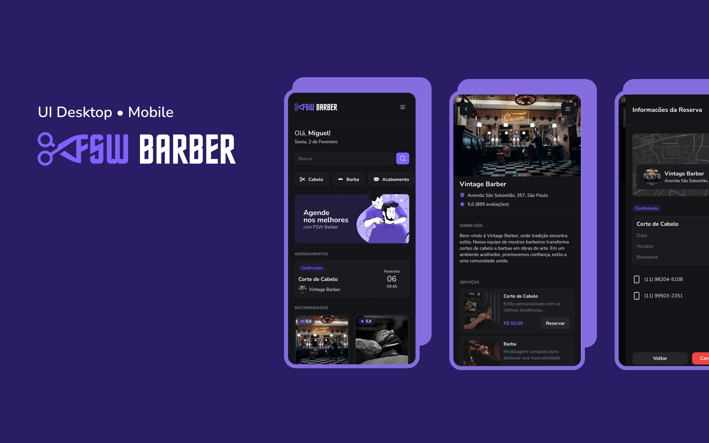

<h1 align="center"> Barbearia FSW </h1>

Desenvolvido durante a FullStack Week para ensino de tecnologias WEB.  

  <a href="#-tecnologias">Tecnologias</a>&nbsp;&nbsp;&nbsp;|&nbsp;&nbsp;&nbsp;
  <a href="#-projeto">Projeto</a>&nbsp;&nbsp;&nbsp;|&nbsp;&nbsp;&nbsp;
  <a href="#memo-licença">Licença</a>

  

 

  

## 🚀 Tecnologias

Esse projeto foi desenvolvido com as seguintes tecnologias:

- HTML e CSS
- Next.js
- React.js
- PostgreSQL
- Tailwind CSS
- Prisma
- Node.js
- ShadCN
- TypeScript
- Java Script
- Git e Github
- Figma

## :memo: Licença

Esse projeto está sob a licença MIT.

---

<a href= "https://lp.fullstackclub.com.br">  Projeto feito pela FullStack Club  </a> 
